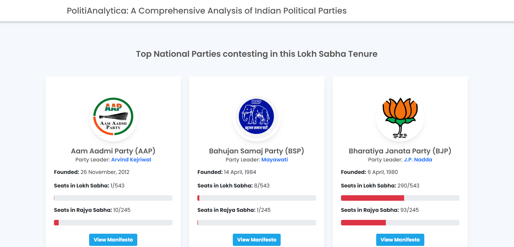

# PolitiAnalytica

PolitiAnalytica is a Django web application that provides a comprehensive analysis of Indian political parties, focusing on their tenure in power, major policies, and their impact on the nation. The project aims to empower users to make informed decisions by providing insights into the performance of political parties at the central government level.



## Table of Contents

- [Features](#features)
- [Installation](#installation)
- [Usage](#usage)
- [Contributing](#contributing)
- [Acknowledgements](#acknowledgements)

## Features

- View the duration of each political party's tenure in power.
- Explore the manifesto of each party and their impact on the nation.
- User-friendly interface for easy navigation and interaction with the data.

## Installation

1. Clone the repository:
   ```bash
   git clone https://github.com/kunal-paul04/politianalytica_project.git
2. Navigate to the project directory:
    ```bash
    cd politianalytica
3. Install dependencies:
    ```bash
        pip install -r requirements.txt
4. Run migrations:
    ```bash
    python manage.py migrate
5. Start the development server:
    ```bash
    python manage.py runserver
6. Access the application at http://127.0.0.1:8000/ in your web browser.

## Usage

- Navigate to the dashboard to view an overview of political party information.
- Explore detailed insights into each political party's performance.
- Use the interactive features to analyze policies and their impact.

## Contributing

Contributions are welcome! If you would like to contribute to PolitiAnalytica, please follow these steps:

1. Fork the repository.
2. Create a new branch (git checkout -b feature/new-feature).
3. Make your changes and commit them (git commit -am 'Add new feature').
4. Push to the branch (git push origin feature/new-feature).
5. Create a new Pull Request.

Please ensure that your contributions adhere to the project's coding standards and include relevant documentation or tests where applicable.

## Acknowledgements
- The template has been downloaded from Smarteyeapps.com.
- The information on this platform is for educational purposes only and should not be used as the sole basis for making decisions regarding individuals.